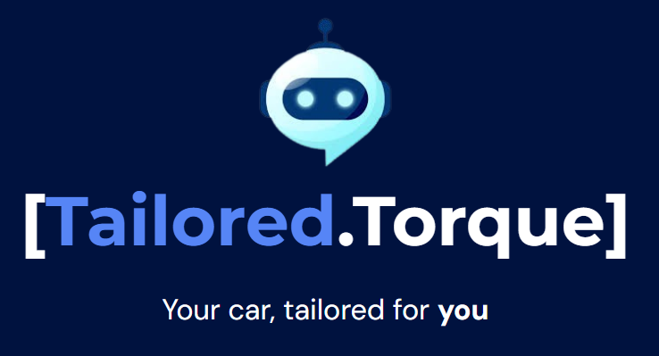

Certainly! Here's a template for the README file:

---

# Tailored.Torque Personalized Mercedes Electric Car Recommendations Bot

## Overview

Tailored.Torque is an advanced self-learning bot designed to offer personalized recommendations for Mercedes electric cars based on users' unique personas and preferences. Leveraging state-of-the-art technologies, including RAG (Retrieval-Augmented Generation) and LangChain, Tailored.Torque delivers tailored suggestions while also providing extensive web search capabilities for answering a wide range of user queries.

## Features

- **Personalized Recommendations:** Utilizes advanced algorithms to understand user preferences and recommend the most suitable Mercedes electric cars.
- **Web Search Integration:** Provides comprehensive answers to diverse user queries through seamless web search capabilities.
- **Fast and Intuitive Interface:** Offers a user-friendly experience with a fast and intuitive interface for effortless interaction.
- **Learning Capabilities:** Continuously learns from user interactions to improve recommendation accuracy and responsiveness.

## How it Works

Tailored.Torque employs a combination of RAG for advanced natural language processing, LangChain for learning and adaptation, and a sleek user interface for seamless interaction. By analyzing user inputs, Tailored.Torque identifies relevant factors such as lifestyle, preferences, and budget to generate personalized recommendations. Furthermore, its integration with web search engines enables it to provide comprehensive answers to a wide array of user queries beyond its primary function.

